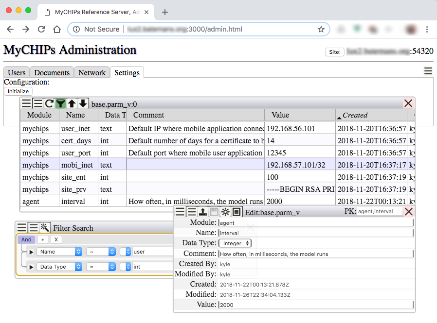

## Wylib: WyattERP Component Library

A library of GUI components, implemented in Vue/javascript, to quickly build a 
web-based application with an optional postgresql backend.

### Status
Wylib is being ported from a legacy codebase (see History below)
and so is currently a work in progress.
The goal is primarily to support the 
[MyCHIPs project](http://www.gotchoices.org/mychips/index.html).
But with this port to javascript, Wylib can now be used to build any web-based 
[SPA](http://wikipedia.org/wiki/Single-page_application).

Here is an example of an application using Wylib:

### System Model
Wylib supports a 
[Model-View-Controller design.](https://en.wikipedia.org/wiki/Model-view-controller)
However, the divisions between these layers are not always perfectly obvious.

In the original implementation Wylib, was mostly responsible for View and 
Control functions.
The PostgreSQL backend contained nearly all the model and some additional 
Control functions.

The javascript version of Wylib enjoys a greater degree of separation, being 
now responsible solely for View functionality.  The backend middleware is 
handled by [Wyseman,](http://github.com/gotchoices/wyseman)
which also manages the PostgreSQL schema.
So between the two, they handle all Control and Model functionality.

Having said that, the Wylib GUI itself has its own "model," in the sense of 
managing how it presents the View.  

This model consists of four aspects: State, Data, Preference, and Layout.

* State: This has to do with the way components are configured on the
	screen, and how they will interact with the data they display.
	Examples include: the size and relative locations of windows and
	subwindows on the screen, settings of which data fields will be
	visible, the order in which fields display, how data will be
	sorted, a history of queries, and so forth.

* Data:	This is what is stored in the Model, and is completely independent
  	of the View, or method in which the data is viewed or accessed.
  	Examples, include: customer names and addresses, invoice totals
  	and inventory items.  The GUI may save information about its
  	state, but it should never retain information about the Model
  	data.  That must come fresh from the backend every time it is
  	accessed.

* Layout: This is currently hard-coded into Wylib (i.e. not reactive).  
	The containers are a function of the way the Vue components work.  
	Much of the layout can be changed by judicious use of the CSS 
	settings, but they would have to be pulled out of the Vue component 
	files and joined into a separate, consolidated location so the GUI 
	could run with a choice of layouts.
  	
  	Right now, the layout is optimized for a desktop environment.  This
  	is done in order to create the most efficient work environment
  	possible.  Mobile layouts are certainly desirable, but whether that
  	is done by an alternate application of CSS rules to this existing
  	set of components, or an entirely separate mobile interface, is yet 
  	to be seen.

* Preferences: These are things the user likes to be a certain way--generally
  	across the application or even the suite.  These fall into two
  	basic categories: CSS and Language.

	It is notable that CSS is referenced in both preferences and Layout.
	It is a bit of a judgement call whether a particular style is one
	or the other.  But typically, things like colors and border shapes
	are a matter of preference.  Something like the order of buttons in 
	a container is more a matter of layout.

	Language is not a CSS issue, but will specify how the components
	explain themselves to the user.

State and Preferences should be entirely reactive, so a change at the root 
level will propagate through the entire DOM hierarchy, on the fly.  That 
should happen fairly automatically for CSS based preferences, but components 
may be responsible for refetching metadata if/when the language changes.

Components need to get their own data direct from the database, or from a
parent that may be managing it.

Preferences are managed by a global object each component can tap into as it
requires, binding styles to any applicable properties.  Typically, preferences
will be modified through a GUI provided by the preferences module itself.  But
it is conceivable that some components might have preferences that apply only
to themselves or their progeny.

State is manged by a reactive prop passed down from parent to child in the
component hierarchy.  If a component sees insufficient data in the state
object to describe its state, it should choose reasonable defaults and apply
them back into the state object.  This goes a bit against Vue's religion, but
then rules are made to be broken.  In short, state can be changed from with a
widget, or from on high.  This allows a higher-up to save, and/or restore
state at will for all or a part of the application.

To the degree possible, changes should be able to occur to State, Preferences,
or Data, without disrupting any of the others' condition.  In other words, a
component should not have to clear its data, simply because its State or
its Preferences changes.

#### History:
This library was originally created in TCL/TK, starting in about 1998.  The 
idea was to create a mega-widget set that allowed one to quickly build ERP 
applications to interact with a PostgreSQL backend.  It was published as
open source software, but mostly used for the author's own business.

The primary problem though, it was not easily adaptable the Internet
(at least without a remote desktop product of some kind).  Early incarnations
of HTML were not particularly friendly to the GUI concepts employed by Wylib
so, short of JAVA or some kind of binary plugin, there didn't seem any good
way to replicate it until the advent of HTML 5 and reactive frameworks.

The Wylib *way* is a bit counter to the notion of *screens* so prevalent in traditional
HTML programming.  In such systems, the user must navigate through a maze of
pre-defined, pre-conceived screens in order to find the correct spot to
interact with the model in the way he wants.  In other words, if the
programmer didn't anticipate what you want to do, you may not be able to do it.  
So you are at the mercy of the forethought of the programmer.

Wylib uses the notion of an *exposed model.*  The idea is to give the user
more visibility into the way the database stores the information and its
relational links.  You open a viewer into the database view you will be
working in, and then use a series of add, update, delete commands to make
the changes you want.  The application programmer crafts each module in such 
a way to make it as friendly as possible to get done what you need to do.

This can make it a little slower to learn how to use a Wylib application.  
However, once you get the hang of the basic data access components, you can 
easily surpass the productivity you might find in a traditional screens-based GUI.

Wylib strives to allow you access to multiple, simultaneous screens or views.
You should be able to open any number of views at once, and interact with them 
as you like.  You query the data according to your own needs so you get just 
the view you want for your particular need.
